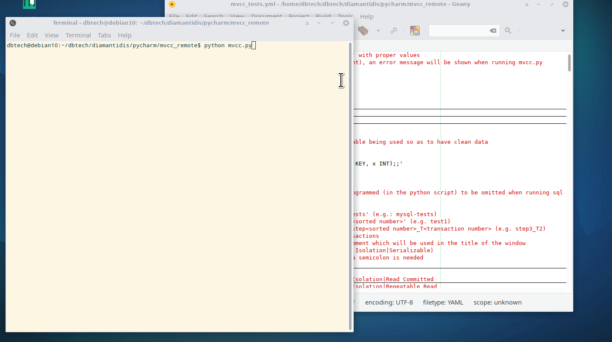

# ``MVCC_sim.py | mvcc_runner.py``


Python scripts that run sql queries against 4 DBMSs to test transactions anomalies and how each DBMS mvcc-based isolation level handles them.


# Prerequisites

  - Debian Linux (tested on 10 buster)
  - MariaDB (tested on 10.3.15)
  - Oracle Express Edition (tested on 11g)
  - PostgreSQL (tested on 11.5)
  - SQL Server (tested on 14)


# Usages
 #### ``MVCC_sim.py``
 _Needs the mvcc_test.yml file in the same directory._
```python
1. $ python MVCC_sim.py
```
Will open a menu to choose a DBMS.
After choosing a DBMS, user will be prompted with the available scenarios.
After choosing a scenario, a new window will open in which the selected scenario will execute.


```python
2. $ python MVCC_sim.py <dbms> (e.g.: python MVCC_sim.py postgres)
```
Will open a menu to choose from the available scenarios of the specified DBMS.
After choosing a scenario, a new window will open in which the selected scenario will execute.

```python
3. $ python MVCC_sim.py <dbms> <test_num> (e.g.: python MVCC_sim.py mysql test3)
```
Will open a new window in which the selected scenario will execute.

 #### ``mvcc_runner.py``
```python
1. $ python mvcc_runner.py <dbms> <test_num> <yaml_file_path>
```
Will execute the selected scenario in the selected DBMS in the current terminal window.
_Note: mvcc_runner.py is used by ``MVCC_sim.py``_
